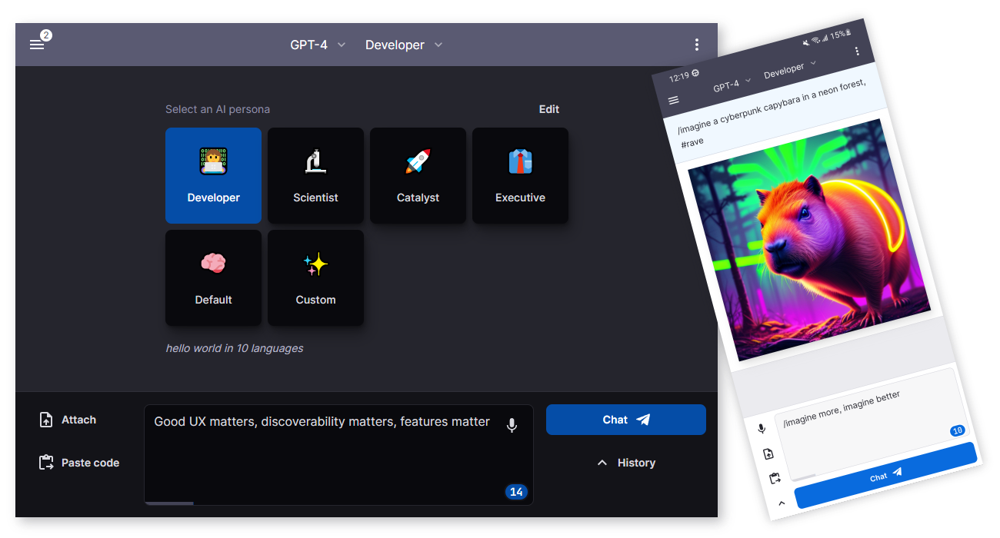

# `FiGPT` 🤖💬

Welcome to `FiGPT`, FKA `nextjs-chatgpt-app`. 👋🎉
Personal AGI App, powered by `OpenAI GPT-4` and beyond. Designed for smart humans and super-heroes,
this responsive web app comes with Personas, Drawing, Code Execution, PDF imports, Voice support,
data Rendering, AGI functions, chats and more. Show your friends some `#Fi-AGI-energy` 🚀

## Useful 👊

- Engaging AI Personas
- Clean UX, w/ tokens counters
- Privacy: user-owned API keys and localStorage
- Human I/O: Advanced voice support (TTS, STT)
- Machine I/O: PDF import & Summarization, code execution
- Many more updates & integrations: ElevenLabs, Helicone, Paste.gg, Prodia
- Coming up: automatic-AGI reasoning

## Support 🙌

[

and Chat 🎭
- 🎉 **Privacy**: user-owned API keys 🔑 and localStorage 🛡️
- 🎉 **Context** - Attach or [Drag & Drop files](docs/pixels/feature_drop_target.png) to add them to the prompt 📁
- 🎉 **Syntax highlighting** - for multiple languages 🌈
- 🎉 **Code Execution: Sandpack** -
   [now on branch]((https://github.com/enricoros/big-agi/commit/f678a0d463d5e9cf0733f577e11bd612b7902d89)) `variant-code-execution`
- 🎉 Chat with GPT-4 and 3.5 Turbo 🧠💨
- 🎉 Real-time streaming of AI responses ⚡
- 🎉 **Voice Input** 🎙️ - works great on Chrome / Windows
- 🎉 Integration: **[Paste.gg](docs/pixels/feature_paste_gg.png)** integration for chat sharing 📥
- 🎉 Integration: **[Helicone](https://www.helicone.ai/)** integration for API observability 📊
- 🌙 Dark model - Wide mode ⛶

 

Made with 💙
